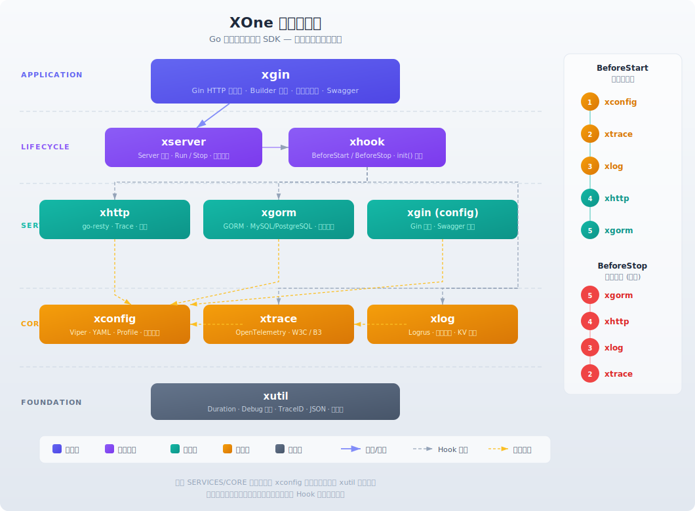

# XOne

开箱即用的 Golang 三方库集成框架

## 架构图



## 功能特性

- 统一集成三方包，降低维护成本
- 通过 YAML 配置启用能力，开箱即用
- 提供最佳实践的默认参数配置
- 支持 Hook 机制，灵活扩展生命周期
- 集成 OpenTelemetry 链路追踪，日志自动关联 TraceID

## 环境要求

- Go >= 1.24

## 快速开始

### 1. 安装

```bash
go get github.com/xiaoshicae/xone
```

### 2. 创建配置文件

创建 `application.yml`（支持放置在 `./`、`./conf/`、`./config/` 目录下）：

```yaml
Server:
  Name: "my-service"
  Version: "v1.0.0"

XGin:
  Port: 8000

XLog:
  Level: "info"
  Console: true

XGorm:
  Driver: "mysql"
  DSN: "user:password@tcp(127.0.0.1:3306)/dbname?charset=utf8mb4&parseTime=True"

XHttp:
  Timeout: "30s"
  MaxIdleConns: 100
  MaxIdleConnsPerHost: 10

XCache:
  MaxCost: 100000
  DefaultTTL: "5m"
```

### 3. 启动服务

```go
package main

import (
	"github.com/xiaoshicae/xone/v2/xgin"
	"github.com/xiaoshicae/xone/v2/xgin/options"
	"github.com/xiaoshicae/xone/v2/xserver"
	"github.com/gin-gonic/gin"
)

func main() {
	gx := xgin.New(
		options.EnableLogMiddleware(true),
		options.EnableTraceMiddleware(true),
	).WithRouteRegister(func(e *gin.Engine) {
		e.GET("/ping", func(c *gin.Context) {
			c.JSON(200, gin.H{"message": "pong"})
		})
	}).Build()

	// 启动服务，自动初始化配置、日志、追踪等所有模块
	gx.Start()
}
```

启动后框架会自动完成：配置加载 → 链路追踪初始化 → 日志初始化 → HTTP 客户端初始化 → 数据库连接 → 启动 Gin 服务。

## 模块清单

| 模块                             | 底层库                                                                 | 说明                               | Log | Trace |
|--------------------------------|---------------------------------------------------------------------|----------------------------------|-----|-------|
| [xconfig](./xconfig/README.md) | [viper](https://github.com/spf13/viper)                             | 配置管理（YAML + 环境变量 + Profile）      | -   | -     |
| [xlog](./xlog/README.md)       | [logrus](https://github.com/sirupsen/logrus)                        | 结构化日志（文件轮转 + KV 注入）              | -   | -     |
| [xtrace](./xtrace/README.md)   | [opentelemetry](https://github.com/open-telemetry/opentelemetry-go) | 链路追踪（W3C + B3 传播格式）              | -   | -     |
| [xhttp](./xhttp/README.md)     | [go-resty](https://github.com/go-resty/resty)                       | HTTP 客户端（重试 + 连接池）               | -   | ✅     |
| [xgorm](./xgorm/README.md)     | [gorm](https://gorm.io/)                                            | 数据库（MySQL / PostgreSQL，多数据源）     | ✅   | ✅     |
| [xcache](./xcache/README.md)   | [ristretto](https://github.com/dgraph-io/ristretto)                 | 本地缓存（支持 TTL / 泛型）               | -   | -     |
| xserver                        | -                                                                   | 服务运行和生命周期管理                      | -   | -     |
| [xgin](./xgin/README.md)       | [gin](https://github.com/gin-gonic/gin)                             | Gin Web 框架集成（Builder 模式 + 内置中间件） | ✅   | ✅     |

## 服务启动方式

```go
import (
"github.com/gin-gonic/gin"
"github.com/xiaoshicae/xone/v2/xgin"
"github.com/xiaoshicae/xone/v2/xgin/options"
"github.com/xiaoshicae/xone/v2/xserver"
)

// 方式一：XGin Start 快捷启动（推荐，支持中间件、Swagger、HTTP/2、TLS）
xgin.New(
options.EnableLogMiddleware(true),
options.EnableTraceMiddleware(true),
).WithRouteRegister(registerRoutes).
WithSwagger(docs.SwaggerInfo).
Build().
Start()

// 方式二：通过 xserver.Run 启动（等价于方式一）
gx := xgin.New(...).Build()
xserver.Run(gx)

// 方式三：自定义 Server（实现 xserver.Server 接口）
xserver.Run(myServer)

// 方式四：阻塞服务（consumer / job 场景）
xserver.RunBlocking()

// 方式五：仅初始化模块，不启动服务（调试用）
xserver.R()
```

TLS 和 HTTP/2 通过 YAML 配置启用：

```yaml
XGin:
  Port: 8443
  UseH2C: true
  CertFile: "cert.pem"
  KeyFile: "key.pem"
```

## 使用模块

### 日志

```go
import "github.com/xiaoshicae/xone/xlog"

// 基础日志
xlog.Info(ctx, "user login success")

// 格式化日志
xlog.Info(ctx, "order created, amount=%d", 99)

// 结构化 KV
xlog.Info(ctx, "request handled",
xlog.KV("userId", "u-123"),
xlog.KV("latency", "50ms"),
)

// 向 context 注入公共字段，后续日志自动携带
ctx = xlog.CtxWithKV(ctx, map[string]interface{}{"requestId": "req-456"})
```

### HTTP 客户端

```go
import "github.com/xiaoshicae/xone/xhttp"

// 发起请求（推荐用 RWithCtx 传递 context，自动关联链路追踪）
resp, err := xhttp.RWithCtx(ctx).
SetHeader("Authorization", "Bearer xxx").
Get("https://api.example.com/users")

// 获取原生 http.Client（适用于 SSE 等流式场景）
rawClient := xhttp.RawClient()
```

配置示例：

```yaml
XHttp:
  Timeout: "30s"
  RetryCount: 3
  MaxIdleConns: 100
  MaxIdleConnsPerHost: 10
```

### 数据库

```go
import "github.com/xiaoshicae/xone/xgorm"

// 查询（推荐用 CWithCtx 传递 context）
var user User
xgorm.CWithCtx(ctx).First(&user, 1)

// 多数据源
masterDB := xgorm.CWithCtx(ctx, "master")
slaveDB := xgorm.CWithCtx(ctx, "slave")
```

单数据库配置：

```yaml
XGorm:
  Driver: "mysql"
  DSN: "user:pass@tcp(127.0.0.1:3306)/mydb?charset=utf8mb4&parseTime=True"
  MaxOpenConns: 50
  EnableLog: true
  SlowThreshold: "3s"
```

多数据库配置：

```yaml
XGorm:
  - Name: "master"
    Driver: "mysql"
    DSN: "user:pass@tcp(127.0.0.1:3306)/master_db"
  - Name: "slave"
    Driver: "postgres"
    DSN: "host=127.0.0.1 user=postgres dbname=slave_db"
```

### 自定义配置

```go
import "github.com/xiaoshicae/xone/xconfig"

// 读取单个值
val := xconfig.GetString("MyApp.ApiKey")
port := xconfig.GetInt("MyApp.Port")
timeout := xconfig.GetDuration("MyApp.Timeout")

// 反序列化到结构体
type MyAppConfig struct {
ApiKey  string `mapstructure:"ApiKey"`
Port    int    `mapstructure:"Port"`
Timeout string `mapstructure:"Timeout"`
}
var cfg MyAppConfig
xconfig.UnmarshalConfig("MyApp", &cfg)
```

### 链路追踪

```go
import "github.com/xiaoshicae/xone/xtrace"

// xhttp、xgorm、xlog 会自动关联 TraceID，一般无需手动操作
// 如需手动创建 Span：
tracer := xtrace.GetTracer("my-service")
ctx, span := tracer.Start(ctx, "my-operation")
defer span.End()
```

配置示例：

```yaml
XTrace:
  Enable: true
  Console: false   # 仅调试时开启控制台输出
```

## 生命周期 Hook

```go
import "github.com/xiaoshicae/xone/xhook"

func init() {
// 服务启动前执行（在所有模块初始化之后）
xhook.BeforeStart(func () error {
// 自定义初始化：预热缓存、检查依赖等
return nil
})

// 服务停止前执行
xhook.BeforeStop(func () error {
// 自定义清理：关闭连接、刷新缓冲等
return nil
})
}
```

## 多环境配置

通过 Profile 加载不同环境的配置文件：

```yaml
# application.yml（公共配置）
Server:
  Name: "my-service"
  Profiles:
    Active: "dev"    # 指定环境
```

框架会按顺序加载：`application.yml` → `application-dev.yml`，后者覆盖前者同名配置。

也可通过环境变量或启动参数指定：

```bash
# 环境变量
export SERVER_PROFILES_ACTIVE=prod

# 启动参数
go run main.go --server.profiles.active=prod
```

## 环境变量

| 环境变量                     | 说明        | 示例                |
|--------------------------|-----------|-------------------|
| `SERVER_ENABLE_DEBUG`    | 启用框架调试日志  | `true`            |
| `SERVER_PROFILES_ACTIVE` | 指定激活的配置环境 | `dev`, `prod`     |
| `SERVER_CONFIG_LOCATION` | 指定配置文件路径  | `/app/config.yml` |

配置文件支持环境变量占位符（带默认值）：

```yaml
XGorm:
  DSN: "${DB_DSN:-user:pass@tcp(localhost:3306)/db}"
```

## 完整配置参考

```yaml
Server:
  Name: "my-service"          # 服务名（必填）
  Version: "v1.0.0"           # 版本号（默认 v0.0.1）
  Profiles:
    Active: "dev"              # 环境标识

XGin:
  Host: "0.0.0.0"             # 监听地址（默认 0.0.0.0）
  Port: 8000                   # 监听端口（默认 8000）
  UseH2C: false              # 非 TLS 下启用 h2c（HTTP/2 Cleartext）
  CertFile: ""                 # TLS 证书路径（配置后自动启用 HTTPS）
  KeyFile: ""                  # TLS 私钥路径

XLog:
  Level: "info"                # 日志级别（默认 info）
  Console: true                # 控制台打印（默认 false）
  Path: "./log/"               # 日志文件夹（默认 ./log/）
  MaxAge: "7d"                 # 日志保留时长（默认 7d）
  RotateTime: "1d"             # 切割周期（默认 1d）

XTrace:
  Enable: true                 # 启用链路追踪（默认 true）
  Console: false               # 控制台打印（默认 false）

XHttp:
  Timeout: "60s"               # 请求超时（默认 60s）
  RetryCount: 3                # 重试次数（默认 0）
  MaxIdleConns: 100            # 最大空闲连接（默认 100）

XGorm:
  Driver: "postgres"           # 驱动（默认 postgres）
  DSN: ""                      # 连接字符串（必填）
  MaxOpenConns: 50             # 最大连接数（默认 50）
  EnableLog: false             # 开启 SQL 日志（默认 false）
  SlowThreshold: "3s"          # 慢查询阈值（默认 3s）
```

## 更新日志

- **v2.1.0** (2026-02-10) - feat: 新增 xerror 统一错误模块；全局 fmt.Errorf 替换为 xerror；xhook 新增 Hook 去重和个体超时；日志中间件增加响应 body 捕获；xutil 新增 RetryWithBackoff；UseHttp2 重命名为 UseH2C
- **v2.0.6** (2026-02-10) - refactor: 移除 ginServer/ginTLSServer，统一为 XGin Builder；新增 Start() 快捷启动；TLS/HTTP2 通过 YAML 配置启用
- **v2.0.5** (2026-02-10) - fix: 修复 swagger 配置未从 YAML 填充到 swag.Spec 的问题；优化 Banner 渐变色；清理 inject 死代码
- **v2.0.4** (2026-02-10) - refactor: 优化日志中间件输出格式，使用路由+HandlerName 替代匿名函数名；修复 Banner 打印逻辑
- **v2.0.3** (2026-02-10) - fix: ginServer 延迟读取配置和打印 Banner 到 Run()，避免启动时 WARN 和 Banner 顺序不对
- **v2.0.2** (2026-02-10) - refactor: Go module 路径迁移至 v2（`github.com/xiaoshicae/xone/v2`）
- **v2.0.1** (2026-02-10) - chore: 合并 merge-ginx 分支到 main，版本号对齐
- **v2.0.0** (2026-02-10) - **BREAKING**: 合并 ginx 为 xgin 子模块，新增 xserver 模块，Gin 配置从 `Server.Gin` 迁移为独立 `XGin` 顶级配置
- **v1.3.1** (2026-02-06) - feat: 新增 xcache 本地缓存模块，基于 ristretto，支持 TTL、泛型 API、多实例
- **v1.2.1** (2026-02-06) - feat: xhttp 新增 DialKeepAlive 配置，支持自定义 TCP keep-alive 探测间隔
- **v1.2.0** (2026-02-05) - feat: xhttp 新增 DialTimeout 配置，支持自定义 TCP 连接超时时间
- **v1.1.5** (2026-02-02) - feat: xtrace 新增 B3 传播格式支持，兼容 W3C Trace Context
- **v1.1.4** (2026-01-30) - fix: xlog ConsoleFormatIsRaw=true 时控制台输出纯 JSON，去除颜色前缀
- **v1.1.3** (2026-01-30) - perf: xlog 文件写入改为异步，避免磁盘 I/O 阻塞调用方
- **v1.1.2** (2026-01-29) - fix: SERVER_PROFILES_ACTIVE 指定的配置文件不存在时忽略并回落到 application.yml
- **v1.1.1** (2026-01-29) - fix: xlog 日志定位文件名误指向 hook 文件
- **v1.1.0** (2026-01-27) - feat: 新增 RunGinTLS 支持 HTTPS 启动; fix: xlog RawLog 增加 ctx nil 检查
- **v1.0.4** (2026-01-27) - fix xconfig 环境变量展开
- **v1.0.3** (2026-01-26) - xtrace 支持 W3C Trace Context propagator
- **v1.0.2** (2026-01-26) - 稳定性修复与测试补充
- **v0.0.8** (2026-01-21) - xhttp 支持重试
- **v0.0.7** (2026-01-21) - 修复 xconfig bug
- **v0.0.6** (2026-01-21) - xhttp 模块优化
- **v0.0.5** (2026-01-04) - 删除 gin 支持 debug mode
- **v0.0.4** (2026-01-04) - gin 支持 debug mode
- **v0.0.3** (2026-01-04) - config 新增 parent 目录检测
- **v0.0.2** (2026-01-04) - 优化 IP 获取
- **v0.0.1** (2026-01-04) - 初始版本
