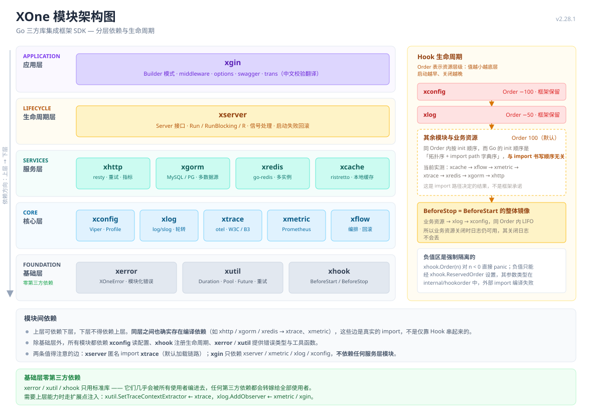

# XOne

开箱即用的 Golang 三方库集成框架

## 架构图



## 功能特性

- 统一集成三方包，降低维护成本
- 通过 YAML 配置启用能力，开箱即用
- 提供最佳实践的默认参数配置
- 支持 Hook 机制，灵活扩展生命周期
- 集成 OpenTelemetry 链路追踪，日志自动关联 TraceID

## 环境要求

- Go >= 1.24

## 快速开始

### 1. 安装

```bash
go get github.com/xiaoshicae/xone
```

### 2. 创建配置文件

创建 `application.yml`（支持放置在 `./`、`./conf/`、`./config/` 目录下）：

```yaml
Server:
  Name: "my-service"
  Version: "v1.0.0"

XGin:
  Port: 8000

XLog:
  Level: "info"

XGorm:
  Driver: "mysql"
  DSN: "user:password@tcp(127.0.0.1:3306)/dbname?charset=utf8mb4&parseTime=True"

XHttp:
  Timeout: "30s"
  MaxIdleConns: 100
  MaxIdleConnsPerHost: 10

XMetric:
  Namespace: "myapp"

XCache:
  MaxCost: 100000
  DefaultTTL: "5m"
```

### 3. 配置 Schema 校验（可选）

项目提供了 JSON Schema 文件，配置后 IDE 会自动补全字段并校验配置值。

**VS Code**（需安装 [YAML 扩展](https://marketplace.visualstudio.com/items?itemName=redhat.vscode-yaml)）

在 YAML 文件首行添加：

```yaml
# yaml-language-server: $schema=https://raw.githubusercontent.com/xiaoshicae/xone/main/config_schema.json
```

或在项目 `.vscode/settings.json` 中统一配置：

```json
{
  "yaml.schemas": {
    "https://raw.githubusercontent.com/xiaoshicae/xone/main/config_schema.json": [
      "application.yml",
      "application-*.yml"
    ]
  }
}
```

**JetBrains（GoLand / IntelliJ）**

`Settings → Languages & Frameworks → Schemas and DTDs → JSON Schema Mappings`，添加映射：

- Schema URL：`https://raw.githubusercontent.com/xiaoshicae/xone/main/config_schema.json`
- Schema version：JSON Schema version 7
- 文件匹配：`application*.yml`
### 4. 启动服务

```go
package main

import (
	"github.com/xiaoshicae/xone/v2/xgin"
	"github.com/xiaoshicae/xone/v2/xgin/options"
	"github.com/xiaoshicae/xone/v2/xserver"
	"github.com/gin-gonic/gin"
)

func main() {
	gx := xgin.New(
		options.EnableLogMiddleware(true),
		options.EnableTraceMiddleware(true),
	).WithRouteRegister(func(e *gin.Engine) {
		e.GET("/ping", func(c *gin.Context) {
			c.JSON(200, gin.H{"message": "pong"})
		})
	}).Build()

	// 启动服务，自动初始化配置、日志、追踪等所有模块
	gx.Start()
}
```

启动后框架会自动完成：配置加载 → 链路追踪初始化 → 日志初始化 → HTTP 客户端初始化 → 数据库连接 → 启动 Gin 服务。

## 模块清单

| 模块                             | 底层库                                                                 | 说明                               | Log | Trace |
|--------------------------------|---------------------------------------------------------------------|----------------------------------|-----|-------|
| [xconfig](./xconfig/README.md) | [viper](https://github.com/spf13/viper)                             | 配置管理（YAML + 环境变量 + Profile）      | -   | -     |
| [xlog](./xlog/README.md)       | [log/slog](https://pkg.go.dev/log/slog)（标准库）                    | 结构化日志（标准输出 + 可选文件轮转 + KV 注入）   | -   | -     |
| [xtrace](./xtrace/README.md)   | [opentelemetry](https://github.com/open-telemetry/opentelemetry-go) | 链路追踪（W3C + B3 传播格式）              | -   | -     |
| [xmetric](./xmetric/README.md) | [prometheus](https://github.com/prometheus/client_golang)            | Prometheus 指标采集（打点 + /metrics 端点） | -   | -     |
| [xhttp](./xhttp/README.md)     | [go-resty](https://github.com/go-resty/resty)                       | HTTP 客户端（重试 + 连接池 + 出站指标）        | -   | ✅     |
| [xgorm](./xgorm/README.md)     | [gorm](https://gorm.io/)                                            | 数据库（MySQL / PostgreSQL，多数据源）     | ✅   | ✅     |
| [xcache](./xcache/README.md)   | [ristretto](https://github.com/dgraph-io/ristretto)                 | 本地缓存（支持 TTL / 泛型）               | -   | -     |
| [xflow](./xflow/README.md)    | -                                                                   | 流程编排（强弱依赖 + 自动回滚 + 监控）        | -   | -     |
| xserver                        | -                                                                   | 服务运行和生命周期管理                      | -   | -     |
| [xgin](./xgin/README.md)       | [gin](https://github.com/gin-gonic/gin)                             | Gin Web 框架集成（Builder 模式 + 内置中间件） | ✅   | ✅     |

## 服务启动方式

```go
import (
    "github.com/gin-gonic/gin"
    "github.com/xiaoshicae/xone/v2/xgin"
    "github.com/xiaoshicae/xone/v2/xgin/options"
    "github.com/xiaoshicae/xone/v2/xserver"
)

// 方式一：XGin Start 快捷启动（推荐，支持中间件、Swagger、HTTP/2、TLS）
xgin.New(
    options.EnableLogMiddleware(true),
    options.EnableTraceMiddleware(true),
).WithRouteRegister(registerRoutes).
WithSwagger(docs.SwaggerInfo).
Build().
Start()

// 方式二：通过 xserver.Run 启动（等价于方式一）
gx := xgin.New(...).Build()
xserver.Run(gx)

// 方式三：自定义 Server（实现 xserver.Server 接口）
xserver.Run(myServer)

// 方式四：阻塞服务（consumer / job 场景）
xserver.RunBlocking()

// 方式五：仅初始化模块，不启动服务（调试用）
xserver.R()
```

TLS 和 HTTP/2 通过 YAML 配置启用：

```yaml
XGin:
  Port: 8443
  UseH2C: true
  CertFile: "cert.pem"
  KeyFile: "key.pem"
```

## 使用模块

### 日志

```go
import "github.com/xiaoshicae/xone/xlog"

// 基础日志
xlog.Info(ctx, "user login success")

// 格式化日志
xlog.Info(ctx, "order created, amount=%d", 99)

// 结构化 KV
xlog.Info(ctx, "request handled",
xlog.KV("userId", "u-123"),
xlog.KV("latency", "50ms"),
)

// 向 context 注入公共字段，后续日志自动携带
ctx = xlog.CtxWithKV(ctx, map[string]interface{}{"requestId": "req-456"})
```

### HTTP 客户端

```go
import "github.com/xiaoshicae/xone/xhttp"

// 发起请求（推荐用 RWithCtx 传递 context，自动关联链路追踪）
resp, err := xhttp.RWithCtx(ctx).
SetHeader("Authorization", "Bearer xxx").
Get("https://api.example.com/users")

// 获取原生 http.Client（适用于 SSE 等流式场景）
rawClient := xhttp.RawClient()
```

配置示例：

```yaml
XHttp:
  Timeout: "30s"
  RetryCount: 3
  MaxIdleConns: 100
  MaxIdleConnsPerHost: 10
```

### 数据库

```go
import "github.com/xiaoshicae/xone/xgorm"

// 查询（推荐用 CWithCtx 传递 context）
var user User
xgorm.CWithCtx(ctx).First(&user, 1)

// 多数据源
masterDB := xgorm.CWithCtx(ctx, "master")
slaveDB := xgorm.CWithCtx(ctx, "slave")
```

单数据库配置：

```yaml
XGorm:
  Driver: "mysql"
  DSN: "user:pass@tcp(127.0.0.1:3306)/mydb?charset=utf8mb4&parseTime=True"
  MaxOpenConns: 50
  EnableLog: true
  SlowThreshold: "3s"
```

多数据库配置：

```yaml
XGorm:
  - Name: "master"
    Driver: "mysql"
    DSN: "user:pass@tcp(127.0.0.1:3306)/master_db"
  - Name: "slave"
    Driver: "postgres"
    DSN: "host=127.0.0.1 user=postgres dbname=slave_db"
```

### 自定义配置

```go
import "github.com/xiaoshicae/xone/xconfig"

// 读取单个值
val := xconfig.GetString("MyApp.ApiKey")
port := xconfig.GetInt("MyApp.Port")
timeout := xconfig.GetDuration("MyApp.Timeout")

// 反序列化到结构体
type MyAppConfig struct {
ApiKey  string `mapstructure:"ApiKey"`
Port    int    `mapstructure:"Port"`
Timeout string `mapstructure:"Timeout"`
}
var cfg MyAppConfig
xconfig.UnmarshalConfig("MyApp", &cfg)
```

### Prometheus 指标

```go
import "github.com/xiaoshicae/xone/v2/xmetric"

// Counter 计数
xmetric.CounterInc("order_created_total", xmetric.T("channel", "wechat"))

// Gauge 实时值
xmetric.GaugeSet("ws_connections", 42, xmetric.T("app", "chat"))

// Histogram 分布
xmetric.HistogramObserve("db_query_duration_ms", 12.5, xmetric.T("table", "orders"))

// /metrics 端点由 xgin 自动注册（默认路径 /metrics，可通过 options.MetricsPath 自定义）
```

配置示例：

```yaml
XMetric:
  Namespace: "myapp"
  ConstLabels:
    env: "prod"
  EnableGoMetrics: true
  EnableLogErrorMetric: true
```

### 链路追踪

```go
import "github.com/xiaoshicae/xone/xtrace"

// xhttp、xgorm、xlog 会自动关联 TraceID，一般无需手动操作
// 如需手动创建 Span：
tracer := xtrace.GetTracer("my-service")
ctx, span := tracer.Start(ctx, "my-operation")
defer span.End()
```

配置示例：

```yaml
XTrace:
  Enable: true
  Console: false             # 仅调试时开启控制台输出
  ForwardHeaders:            # 全局透传的自定义 Header（向所有下游服务透传）
    - X-Request-Id
  ForwardHeaderRules:        # 按域名透传（仅匹配的域名才透传，防止敏感 Header 泄漏）
    - Domains:
        - "*.svc.cluster.local"
      Headers:
        - X-Auth-Token
        - X-Tenant-Id
```

## 生命周期 Hook

```go
import "github.com/xiaoshicae/xone/xhook"

func init() {
    // 服务启动前执行（在所有模块初始化之后）
    xhook.BeforeStart(func () error {
    // 自定义初始化：预热缓存、检查依赖等
    return nil
    })
    
    // 服务停止前执行
    xhook.BeforeStop(func () error {
    // 自定义清理：关闭连接、刷新缓冲等
    return nil
    })
}
```

## 多环境配置

通过 Profile 加载不同环境的配置文件：

```yaml
# application.yml（公共配置）
Server:
  Name: "my-service"
  Profiles:
    Active: "dev"    # 指定环境
```

框架会按顺序加载：`application.yml` → `application-dev.yml`，后者覆盖前者同名配置。

也可通过环境变量或启动参数指定：

```bash
# 环境变量
export SERVER_PROFILES_ACTIVE=prod

# 启动参数
go run main.go --server.profiles.active=prod
```

## 环境变量

| 环境变量                     | 说明        | 示例                |
|--------------------------|-----------|-------------------|
| `SERVER_ENABLE_DEBUG`    | 启用框架调试日志  | `true`            |
| `SERVER_PROFILES_ACTIVE` | 指定激活的配置环境 | `dev`, `prod`     |
| `SERVER_CONFIG_LOCATION` | 指定配置文件路径  | `/app/config.yml` |

配置文件支持环境变量占位符（带默认值）：

```yaml
XGorm:
  DSN: "${DB_DSN:-user:pass@tcp(localhost:3306)/db}"
```

## 完整配置参考

```yaml
Server:
  Name: "my-service"          # 服务名（必填）
  Version: "v1.0.0"           # 版本号（默认 v0.0.1）
  Profiles:
    Active: "dev"              # 环境标识

XGin:
  Host: "0.0.0.0"             # 监听地址（默认 0.0.0.0）
  Port: 8000                   # 监听端口（默认 8000）
  UseH2C: false              # 非 TLS 下启用 h2c（HTTP/2 Cleartext）
  CertFile: ""                 # TLS 证书路径（配置后自动启用 HTTPS）
  KeyFile: ""                  # TLS 私钥路径

XLog:
  Level: "info"                # 日志级别（默认 info），两路输出共用
  Timezone: "Asia/Shanghai"    # 时区（默认 Asia/Shanghai），两路输出共用
  Console:
    Enable: true               # 控制台输出（默认 true）
    Format: "text"             # 输出格式（默认 text），可选 text / json
  File:
    Enable: false              # 写日志文件（默认 false，仅输出到标准输出）
    Path: "./log"              # 日志文件夹（默认 ./log）
    Name: "app"                # 日志文件名（默认 app）
    MaxAge: "7d"               # 日志保留时长（默认 7d）
    RotateTime: "1d"           # 切割周期（默认 1d，最小 1m）

XTrace:
  Enable: true                 # 启用链路追踪（默认 true）
  Console: false               # 控制台打印（默认 false）
  ForwardHeaders:              # 全局透传的自定义 Header（默认无）
    - X-Request-Id
  ForwardHeaderRules:          # 按域名透传的 Header 规则（默认无）
    - Domains:                 # 域名模式，支持 *.example.com 通配
        - "*.svc.cluster.local"
      Headers:                 # 仅匹配域名时才透传的 Header
        - X-Auth-Token
        - X-Tenant-Id

XMetric:
  Namespace: "myapp"             # 指标命名空间前缀
  ConstLabels:                   # 全局常量标签（区分环境等）
    env: "prod"
  HttpDurationBuckets:           # HTTP 入站/出站请求耗时桶边界（毫秒，默认 [1,5,10,25,50,100,250,500,1000,2500,5000,10000]）
    - 1
    - 5
    - 10
    - 25
    - 50
    - 100
    - 250
    - 500
    - 1000
    - 2500
    - 5000
    - 10000
  HistogramObserveBuckets:       # HistogramObserve() 业务指标桶边界（秒，默认 prometheus.DefBuckets）
    - 0.005
    - 0.01
    - 0.025
    - 0.05
    - 0.1
    - 0.25
    - 0.5
    - 1
    - 2.5
    - 5
    - 10
  EnableGoMetrics: true          # Go runtime 指标（默认 true）
  EnableProcessMetrics: true     # 进程指标（默认 true）
  EnableLogErrorMetric: true     # xlog.Error 自动上报（默认 true）

XHttp:
  Timeout: "60s"               # 请求超时（默认 60s）
  RetryCount: 3                # 重试次数（默认 0）
  MaxIdleConns: 100            # 最大空闲连接（默认 100）
  EnableMetric: true           # 出站请求指标采集（默认 true）

XGorm:
  Driver: "postgres"           # 驱动（默认 postgres）
  DSN: ""                      # 连接字符串（必填）
  MaxOpenConns: 50             # 最大连接数（默认 50）
  EnableLog: false             # 开启 SQL 日志（默认 false）
  SlowThreshold: "3s"          # 慢查询阈值（默认 3s）
```

## 更新日志

- **v2.23.0** (2026-09-13) - fix(xutil)!: the concurrency primitives in the base layer could take the process down three ways. Submitting to a pool while another goroutine shut it down panicked with "send on closed channel" — the close landed between Submit's context check and its send, and a send on a closed channel is ready in a select rather than skipped; sending and closing are now mutually exclusive under an RWMutex, and Submit reports whether the task was accepted. A panic inside Async, Go or any submitted task killed the process and the worker with it, while xflow, xhook, xlog and xmetric all isolate theirs; panics now become errors on the Future, or a log line for fire-and-forget tasks. And Go on a closed pool returned a Future whose channel was never closed, so every Get on it blocked forever — it completes with ErrPoolClosed instead. The default pool is now created on first use: importing xutil, which every module does, started 100 worker goroutines in every service whether or not it ever submitted anything. RetryWithBackoff doubled its delay before clamping it, so an int64 nanosecond overflow after about twenty doublings turned it negative and disabled backoff entirely; add RetryWithContext and RetryWithBackoffContext so an initialization retry cannot hold shutdown for attempts×sleep. Also stop matching an argument's value as if it were a key in GetConfigFromArgs, and replace the last fmt.Errorf calls with xerror (BREAKING: Submit returns bool; Future gains GetWithContext)
- **v2.22.0** (2026-09-13) - fix(xmetric): a metric name registered twice under different types silently stopped being exported — the second collector failed its type assertion, stayed out of the registry, and went on accepting values nothing would ever scrape, without a word in the logs; the conflict is now reported. GetConfig and GetHttpDurationBuckets handed out the module's own config pointer and backing array, so any caller could corrupt global state by writing to what it received, and now return copies. Re-initialization panicked outright on MustRegister for the Go and process collectors, and when it did not, the collector cache and the outbound-HTTP sync.Once kept the first Namespace and buckets forever; registration is safe now and closing clears the cache. Add ObserveDuration and Timer, which take a time.Duration and settle both the type and the unit: HistogramObserve defaults to second-based buckets while the HTTP metrics are milliseconds, so timing values passed as milliseconds landed entirely in the +Inf bucket and quantiles were quietly useless. Also fold the three near-identical getOrCreate functions into one generic, log rather than swallow a rejected exemplar, and give the README a decision table, naming conventions and the unit warning
- **v2.21.0** (2026-09-13) - refactor(xflow)!: collapse Flow[Req, Resp] to Flow[T] and fix four defects the old shape hid. Every processor method had to repeat *xflow.FlowData[OrderReq, OrderResp]; one type parameter holding the caller's own struct leaves only business types in those signatures, and deletes FlowData, Key, NewKey, SetExtra and GetExtra along with their runtime type assertions — intermediate data is now a plain field, checked at compile time. Rollback ran on the caller's context, so a request timeout meant every compensation was rejected the moment it started and the resources it was meant to release leaked; it now runs on context.WithoutCancel bounded by a new XFlow.RollbackTimeout, and processors left uncompensated when that budget runs out are reported individually. A nil processor crashed with a bare nil dereference at execution time because Name() sat outside the recover, and now panics at New; a panicking Monitor took the whole flow down with it and is now isolated like xlog's observers; and a canceled context no longer runs the remaining processors. Configuration moves from a sync.Once read — which froze whatever it saw, so a setting loaded later never took effect — to a BeforeStart hook, with DisableMonitor replaced by EnableMonitor (BREAKING: Req/Resp merge into one struct, the extra-data API is gone, ExecuteResult is no longer generic, and XFlow.DisableMonitor becomes XFlow.EnableMonitor)
- **v2.20.0** (2026-09-13) - refactor(xutil/xhook)!: take the base layer down to zero third-party packages, which is what the architecture rules always claimed it was. Two helpers in xutil read the trace and span id from a context and imported go.opentelemetry.io/otel/trace to do it, so every service importing xone compiled the whole otel trace/attribute tree whether or not it used tracing — xutil 11 packages, xhook 12. The extraction is now injected by xtrace at init, the same shape as xlog.AddObserver and xtrace.AddSpanProcessor, and both modules are at 0. Also replace golang.org/x/exp/slices with the standard library, whose slices package has had SortStableFunc, Clone and Reverse since Go 1.21, and spf13/cast with about twenty lines of standard library, preserving its lenient duration parsing (a bare number is nanoseconds). Adds xutil.GetTraceAndSpanIDFromCtx, which the log and metric paths use to fetch both ids in one call (BREAKING: xlog and xmetric report no trace id unless xtrace is imported or xutil.SetTraceContextExtractor is called; golang.org/x/exp is no longer a dependency)
- **v2.19.0** (2026-09-13) - chore!: remove the xpipeline module, which nothing in the repository imported (BREAKING: github.com/xiaoshicae/xone/v2/xpipeline no longer exists)
- **v2.18.0** (2026-09-13) - feat(xtrace): add AddSpanProcessor so a service can report spans to OTLP, Jaeger or anything else by supplying its own exporter. The framework deliberately ships none: an OTLP exporter drags in 143 build packages (grpc, protobuf, genproto, proto/otlp) and every user of xtrace would compile them whether or not they report. Registration works before or after initialization and survives re-initialization — user processors are shielded from the outgoing provider's shutdown and closed by xtrace instead. Also bound the shutdown wait with a new XTrace.ShutdownTimeout (default 5s): TracerProvider.Shutdown blocks until its context expires when the collector is unreachable, and the previous unbounded context would have leaked that goroutine past xhook's hook timeout
- **v2.17.0** (2026-09-13) - fix(xconfig)!: a profile file that overrode one field of a block silently deleted the rest of it — `XLog: {Level: debug}` in application-dev.yml dropped the File settings the base file had set, because merging replaced whole top-level keys; merging is now recursive, with lists still replaced outright and Server.Profiles still excluded. Mask credentials before printing the loaded configuration, which dumped every password and key in plaintext under debug. Reject a profiles-active value containing path separators, which composed an arbitrary path into the config filename. Placeholder expansion now distinguishes an unset variable from one set to the empty string, so `${VAR:-default}` can be overridden with an empty value; an unset `${VAR}` with no default fails initialization instead of silently becoming "", making it the way to mark a setting required; expansion runs once after the merge rather than before and after, so an environment variable whose own value contains `${...}` is no longer re-expanded; and placeholders inside string lists are expanded like map values already were. Also reject a typed nil pointer in UnmarshalConfig, wrap unmarshal failures as XOneError, and drop the merge helpers the recursive version replaced
- **v2.16.0** (2026-09-13) - fix(xtrace)!: header forwarding no longer dies silently when tracing is off — Enable=false kept the NoopTracerProvider but dropped the HeaderPropagator, and xhttp stopped wrapping the transport, so a configured ForwardHeaders forwarded nothing. A header listed in both ForwardHeaders and ForwardHeaderRules was injected globally, which defeated the domain restriction those rules exist to enforce; the stricter rule now wins. Replace the deprecated NewNoopTracerProvider, shut the previous TracerProvider down on re-initialization, drop a redundant CAS whose window let a concurrent shutdown close a freshly built provider, fall back to http.DefaultTransport instead of panicking on a nil Next, and add a SampleRatio setting in place of the hardcoded AlwaysSample. README documented a SetShutdownTimeout that never existed (BREAKING: XTrace.Console is now XTrace.EnableConsole)
- **v2.15.1** (2026-09-13) - fix(xhook): registering closures in a loop silently dropped all but the first, since every closure from one function literal shares a code pointer and registration deduplicated on it; deduplication is removed. Order is now documented and tested as a resource layer — smaller starts earlier and stops later — so BeforeStop is the exact mirror of BeforeStart and a module needs only one Order value to start early and stop late. xlog's close hook moves from a lazy Order(9999) registration to an init()-time reserved layer — Go's init order is topological with an import-path tie-break and ignores the written import order, so registration order alone cannot keep the log writer open until last; a user package whose module path sorts before github.com would outlive it and lose its shutdown logs. Negative Order is now a framework-reserved band (xconfig -100, xlog -50) that application hooks cannot enter: Order(n) panics below zero, and the only way to set a negative layer takes a type from internal/hookorder, which no external module can import. Also stop a stop hook from running without a timeout once the overall budget is spent, and fold the parallel package variables into a registry type
- **v2.15.0** (2026-09-12) - refactor(xlog)!: split the log configuration into Console and File blocks, each owning its own settings, and replace ConsoleFormatIsRaw with Console.Format ("text" / "json"); reject a RotateTime below one minute, which the filename's time suffix cannot express (BREAKING: move EnableFile/Path/Name/MaxAge/RotateTime under File, EnableConsole/ConsoleFormatIsRaw under Console; the old top-level keys are no longer read)
- **v2.14.2** (2026-09-12) - fix(xlog): an unparseable or negative RotateTime silently degraded daily rotation into a new file every minute; re-initialization also closed the previous file writer before publishing the new handler, dropping anything logged during the switch. Raise every file in the module to full statement coverage, mostly over the error paths the writers had never exercised
- **v2.14.1** (2026-09-12) - perf(xlog): cache caller lookups by program counter, skipping the symbol resolution that dominated the remaining log path (1.6x throughput, 60% less garbage); isolate observer panics, serialize console writes so long lines such as panic stacks cannot interleave, and collapse a redundant attribute pass
- **v2.14.0** (2026-09-12) - refactor(xlog)!: move the logging backend to the standard library's log/slog and drop logrus, leaving the module with no third-party logging dependency (~2.1x throughput, 46% fewer allocations on top of v2.13.0); expose xlog.Handler/xlog.Logger so third-party libraries can share the same output configuration (BREAKING: xutil.LogIfEnableDebug is now unexported, use Error/Warn/InfoIfEnableDebug)
- **v2.13.0** (2026-09-12) - perf(xlog): serialize each log line at most once and drop regex matching from caller lookup (~2.7x throughput, 65% fewer allocations); fix panic-level logs never reaching the log file and console/file timestamps disagreeing on timezone; use a private logrus instance instead of mutating the global one, with xlog.AddObserver as the extension point xmetric and xgin now use in place of global logrus hooks; replace the unmaintained file-rotatelogs dependency with a built-in time-based rotating writer, dropping 3 modules from go.mod (BREAKING: `RawLog` takes `xlog.Level` instead of `logrus.Level`, `XLogCtxKVContainerKey` removed)
- **v2.12.0** (2026-09-12) - feat(xlog): console-only logging by default for container environments, file output opt-in via EnableFile; tighten XLog config schema validation (BREAKING: set `XLog.EnableFile: true` to keep writing log files, `XLog.Console` renamed to `XLog.EnableConsole`)
- **v2.11.0** (2026-04-17) - feat(xgorm): inject PostgreSQL timeouts into DSN and refactor Config with nested MySQL/Postgres sub-blocks (BREAKING: ReadTimeout/WriteTimeout moved under MySQL.*)
- **v2.10.1** (2026-03-12) - fix: move HTTP outbound metrics from Transport to Resty layer to avoid retry inflation, add exemplar panic recovery
- **v2.10.0** (2026-03-12) - feat: add Exemplar support to HTTP outbound metrics with path, trace_id, and span_id for request-level debugging
- **v2.9.1** (2026-03-11) - refactor: consolidate xmetric config, unify HTTP duration buckets, auto-register /metrics endpoint in xgin, update docs and schema
- **v2.9.0** (2026-03-11) - feat: add xmetric Prometheus module with Counter/Gauge/Histogram APIs, Gin middleware, xhttp outbound metrics, and xlog error auto-report
- **v2.8.0** (2026-03-10) - feat: add domain-based header forwarding rules in xtrace HeaderPropagator via ForwardHeaderRules config
- **v2.7.0** (2026-02-24) - feat: add custom header propagation in xtrace via HeaderPropagator for automatic forwarding of headers like X-Request-ID across services
- **v2.6.0** (2026-02-17) - feat: add xpipeline streaming pipeline module with goroutine+channel chaining, monitor support, and 100% test coverage
- **v2.5.0** (2026-02-14) - feat: refactor xflow to dual-generic Flow[Req, Resp] with FlowData and self-contained ExecuteResult
- **v2.4.0** (2026-02-14) - feat: add Future async task and Pool worker pool utilities in xutil
- **v2.3.1** (2026-02-14) - fix: reverse BeforeStop hook execution order to ensure LIFO symmetry with BeforeStart
- **v2.3.0** (2026-02-13) - feat: add xredis module with production-optimized defaults, fix README import paths to v2
- **v2.2.6** (2026-02-13) - chore: remove all required constraints from config schema
- **v2.2.5** (2026-02-13) - chore: add [XOne-Debug] prefix to framework debug logs for better distinction
- **v2.2.4** (2026-02-12) - fix: fix env placeholder expansion for non-string types, xgin srv race condition, xhttp missing close hook, xgorm ping timeout and multi-init rollback
- **v2.2.3** (2026-02-12) - fix: resolve concurrency bugs and optimize xgin middleware performance
- **v2.2.2** (2026-02-12) - fix: 修复跨模块并发安全问题，优化 xgin middleware 敏感字段过滤性能
- **v2.2.1** (2026-02-11) - refactor: xflow 移除 FlowContext，Processor 接口简化为 (ctx, T) 双参数
- **v2.2.0** (2026-02-11) - feat: 新增 xflow 流程编排模块，支持强弱依赖、自动回滚、Monitor 监控
- **v2.1.6** (2026-02-11) - perf: 跨模块性能优化，xerror/xgorm/xlog/xutil 热路径减少内存分配
- **v2.1.5** (2026-02-11) - perf: xgin 中间件性能优化，减少热路径内存分配和字符串转换
- **v2.1.4** (2026-02-11) - refactor: xserver 修复信号泄漏、修正拼写错误、简化 run() 错误处理
- **v2.1.3** (2026-02-11) - refactor: xtrace EnableTrace 逻辑重构、测试覆盖率提升至 100%；EnableDebug 重命名为 EnableXOneDebug，环境变量改为 XONE_ENABLE_DEBUG
- **v2.1.2** (2026-02-11) - refactor: xlog 模块优化，修复 asyncWriter 多次关闭、消除 consolePrint 重复栈回溯、interface{} 统一为 any
- **v2.1.1** (2026-02-11) - refactor: xutil 全面重构，修复 ToPrt 拼写和 cmd.go 参数截断 bug，消除死代码，优化 log 正则合并，测试覆盖率提升至 100%
- **v2.1.0** (2026-02-10) - feat: 新增 xerror 统一错误模块；全局 fmt.Errorf 替换为 xerror；xhook 新增 Hook 去重和个体超时；日志中间件增加响应 body 捕获；xutil 新增 RetryWithBackoff；UseHttp2 重命名为 UseH2C
- **v2.0.6** (2026-02-10) - refactor: 移除 ginServer/ginTLSServer，统一为 XGin Builder；新增 Start() 快捷启动；TLS/HTTP2 通过 YAML 配置启用
- **v2.0.5** (2026-02-10) - fix: 修复 swagger 配置未从 YAML 填充到 swag.Spec 的问题；优化 Banner 渐变色；清理 inject 死代码
- **v2.0.4** (2026-02-10) - refactor: 优化日志中间件输出格式，使用路由+HandlerName 替代匿名函数名；修复 Banner 打印逻辑
- **v2.0.3** (2026-02-10) - fix: ginServer 延迟读取配置和打印 Banner 到 Run()，避免启动时 WARN 和 Banner 顺序不对
- **v2.0.2** (2026-02-10) - refactor: Go module 路径迁移至 v2（`github.com/xiaoshicae/xone/v2`）
- **v2.0.1** (2026-02-10) - chore: 合并 merge-ginx 分支到 main，版本号对齐
- **v2.0.0** (2026-02-10) - **BREAKING**: 合并 ginx 为 xgin 子模块，新增 xserver 模块，Gin 配置从 `Server.Gin` 迁移为独立 `XGin` 顶级配置
- **v1.3.1** (2026-02-06) - feat: 新增 xcache 本地缓存模块，基于 ristretto，支持 TTL、泛型 API、多实例
- **v1.2.1** (2026-02-06) - feat: xhttp 新增 DialKeepAlive 配置，支持自定义 TCP keep-alive 探测间隔
- **v1.2.0** (2026-02-05) - feat: xhttp 新增 DialTimeout 配置，支持自定义 TCP 连接超时时间
- **v1.1.5** (2026-02-02) - feat: xtrace 新增 B3 传播格式支持，兼容 W3C Trace Context
- **v1.1.4** (2026-01-30) - fix: xlog ConsoleFormatIsRaw=true 时控制台输出纯 JSON，去除颜色前缀
- **v1.1.3** (2026-01-30) - perf: xlog 文件写入改为异步，避免磁盘 I/O 阻塞调用方
- **v1.1.2** (2026-01-29) - fix: SERVER_PROFILES_ACTIVE 指定的配置文件不存在时忽略并回落到 application.yml
- **v1.1.1** (2026-01-29) - fix: xlog 日志定位文件名误指向 hook 文件
- **v1.1.0** (2026-01-27) - feat: 新增 RunGinTLS 支持 HTTPS 启动; fix: xlog RawLog 增加 ctx nil 检查
- **v1.0.4** (2026-01-27) - fix xconfig 环境变量展开
- **v1.0.3** (2026-01-26) - xtrace 支持 W3C Trace Context propagator
- **v1.0.2** (2026-01-26) - 稳定性修复与测试补充
- **v0.0.8** (2026-01-21) - xhttp 支持重试
- **v0.0.7** (2026-01-21) - 修复 xconfig bug
- **v0.0.6** (2026-01-21) - xhttp 模块优化
- **v0.0.5** (2026-01-04) - 删除 gin 支持 debug mode
- **v0.0.4** (2026-01-04) - gin 支持 debug mode
- **v0.0.3** (2026-01-04) - config 新增 parent 目录检测
- **v0.0.2** (2026-01-04) - 优化 IP 获取
- **v0.0.1** (2026-01-04) - 初始版本
