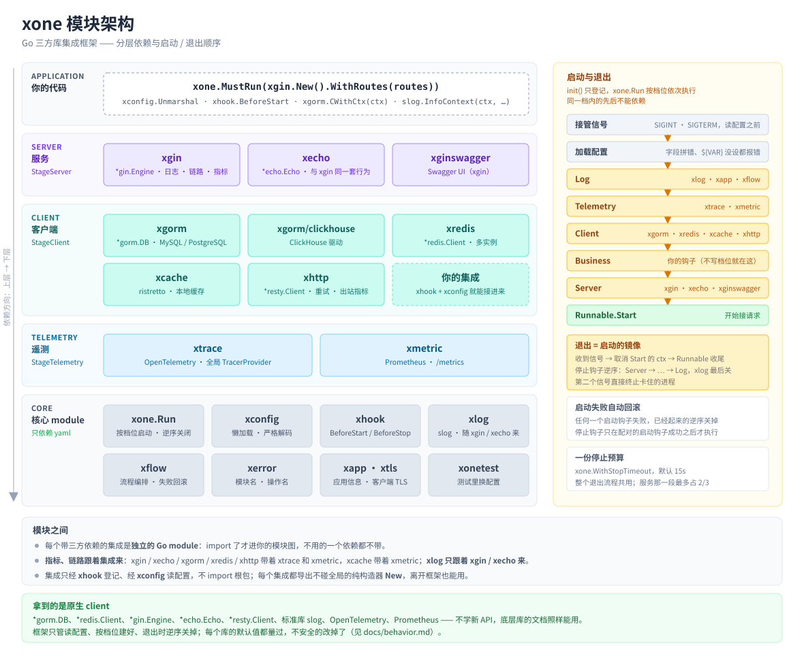

# xone

开箱即用的 Go 三方库集成框架。

写一个 YAML、调一次 `xone.Run`：框架读配置、按顺序建好各组件、收到退出信号逆序关掉。
你拿到的是**原生 client**——`*gorm.DB`、`*redis.Client`、`*gin.Engine`、标准库 `slog`，不用学新 API。



## 特性

- **没有装配样板** —— import 想用的集成就行，初始化、关闭、先后顺序都是框架的事
- **配置驱动，写错就失败** —— 默认值预填；字段拼错、`${VAR}` 没设、值不合法，启动时带着文件和行号报出来
- **日志 / 链路 / 指标自动串起来** —— 日志带 `trace_id`，出站请求、SQL、Redis 命令进同一条链路，连接池自带指标
- **默认值量过** —— 接的每个库的默认行为都实测过，不安全的改掉了（比如 gin 默认信任所有代理），见 [behavior.md](docs/behavior.md)
- **用什么付什么** —— 每个带三方依赖的集成是独立的 Go module，不用的不进你的模块图

## 快速开始

**1. 安装**（核心 Go 1.23+，集成 Go 1.25+；所有模块共用一个版本号，写同一个）

```bash
go get github.com/xiaoshicae/xone@v1.23.0 github.com/xiaoshicae/xone/xgin@v1.23.0
```

升级时同样把用到的每个 xone 模块列全、写同一个版本号。只升核心，Go 的 MVS 让 xgin 留在旧版本；
只升一个集成，会把它依赖的核心（以及 xmetric、xtrace）一起拉上去——两种都会让各模块版本对不上。
别用 `go get -u ./...`，它连所有间接依赖都升了。

**2. 写配置** `conf/application.yml`（只写要改的，其余用默认值）

```yaml
XApp:
  Name: hello-api
XGin:
  Port: 8080
```

**3. 启动**

```go
package main

import (
	"log/slog"
	"net/http"

	"github.com/gin-gonic/gin"

	"github.com/xiaoshicae/xone"
	"github.com/xiaoshicae/xone/xgin"
)

func main() {
	xone.MustRun(xgin.New().WithRoutes(func(e *gin.Engine) {
		e.GET("/hello", func(c *gin.Context) {
			slog.InfoContext(c.Request.Context(), "hello called") // 已按 XLog 配好，带 trace_id
			c.JSON(http.StatusOK, gin.H{"msg": "hello"})
		})
	}))
}
```

```bash
go run .                      # 自动找到 conf/application.yml
curl localhost:8080/hello     # {"msg":"hello"}；访问日志、链路、/metrics 已经挂上
# Ctrl+C 优雅退出：等在途请求结束、逆序关掉各组件；卡住时再按一次立即终止
```

更完整的可运行示例在 [`example/`](example/)：Web 服务、消息队列消费者、自己写一个集成。

## 模块

| 模块 | 底层库 | 给你什么 |
|---|---|---|
| [xgin](xgin/README.md) | [gin](https://github.com/gin-gonic/gin) | Web 服务，内置访问日志、链路、指标、panic 恢复 |
| [xginswagger](xginswagger/README.md) | [gin-swagger](https://github.com/swaggo/gin-swagger) | Swagger UI |
| [xecho](xecho/README.md) | [Echo](https://github.com/labstack/echo) v4 | Web 服务，和 xgin 同一套访问日志、链路、指标、panic 恢复，换成 Echo |
| [xgorm](xgorm/README.md) | [gorm](https://gorm.io/) | `*gorm.DB`，内置 MySQL / PostgreSQL，多数据源 |
| [xgorm/clickhouse](xgorm/clickhouse/README.md) | [gorm ClickHouse 驱动](https://github.com/go-gorm/clickhouse) | 给 xgorm 加 ClickHouse |
| [xredis](xredis/README.md) | [go-redis](https://github.com/redis/go-redis) | `*redis.Client`，多实例 |
| [xcache](xcache/README.md) | [ristretto](https://github.com/dgraph-io/ristretto) | 本地缓存，按类型取值 |
| [xhttp](xhttp/README.md) | [resty](https://github.com/go-resty/resty) | 出站 HTTP，重试、链路、指标 |
| [xcron](xcron/README.md) | [cronexpr](https://github.com/hashicorp/cronexpr)（只用来解析） | 进程内的定时任务，每次执行带链路和日志字段，退出时等在途的跑完 |
| [xtrace](xtrace/README.md) | [OpenTelemetry](https://github.com/open-telemetry/opentelemetry-go) | 链路，设为全局 TracerProvider |
| [xmetric](xmetric/README.md) | [Prometheus](https://github.com/prometheus/client_golang) | 指标打点，`/metrics` 由 xgin / xecho 挂上 |
| [xlog](xlog/README.md) | [log/slog](https://pkg.go.dev/log/slog)（标准库） | 结构化日志，文件轮转，请求级字段 |
| [xconfig](xconfig/README.md) | — | 读自己的配置块 |
| [xflow](xflow/README.md) | — | 流程编排，失败自动回滚 |
| [xapp](xapp/README.md) · [xtls](xtls/README.md) | — | 应用名 / 版本 · 客户端 TLS（XGorm / XRedis / XHttp 共用） |

`xconfig`、`xlog`、`xflow`、`xapp`、`xtls`、`xhook`、`xerror`、`xutil`、`xonetest` 都在核心模块里，核心只依赖 yaml。
有几个不用自己 import，跟着别的模块来：

| 模块 | 跟着谁来 | 一个都没用时 |
|---|---|---|
| `xapp`（`XApp` 块） | `xone` 本身 | —— |
| `xlog` | xgin、xecho、xcron | 框架不接管日志，`slog.Default()` 还是你自己的；要用就匿名 import `github.com/xiaoshicae/xone/xlog` |
| `xtrace`、`xmetric` | xgin、xecho、xgorm、xredis、xhttp；xcache 只带 xmetric，xcron 只带 xtrace | 想要时匿名 import，见 [可观测「链路」](docs/observability.md#链路) |

## 常用写法

完整用法见各模块的 README，这里只列最常用的。

**日志** —— 标准库 `slog`，用带 ctx 的方法才带得上 `trace_id`：

```go
slog.InfoContext(ctx, "order created", "order_id", id, "amount", amount)

xlog.AddKV(ctx, "user_id", uid)                             // 之后这个请求的每条日志都带着
ctx = xlog.CtxWithKV(ctx, map[string]any{"order_id": id})   // 只影响用新 ctx 写的日志
```

**数据库 / Redis / 本地缓存**：

```go
var u User
err := xgorm.CWithCtx(ctx).First(&u, id).Error   // 多数据源：xgorm.CWithCtx(ctx, "report")

v, err := xredis.C().Get(ctx, "k").Result()

xcache.Set("user:1", u)
cached, ok := xcache.Get[User]("user:1")
```

**出站 HTTP**（链路头、指标自动带上）：

```go
resp, err := xhttp.R(ctx).SetResult(&out).Get("https://api.example.com/users/1")
```

**指标**：

```go
xmetric.CounterInc("orders_created_total", xmetric.T("channel", "app"))
xmetric.ObserveDuration("payment_call", time.Since(start))
defer xmetric.TrackInFlight("jobs_in_flight")()
```

**读自己的配置**：

```go
var c struct {
	Timeout time.Duration `yaml:"Timeout"`
}
err := xconfig.Unmarshal("Order", &c)   // 读 application.yml 里的 Order 块，什么时候调都行
```

## 启动方式

```go
xone.MustRun(xgin.New().WithRoutes(routes))   // Web 服务
xone.MustRun(xone.UntilSignal())              // 常驻进程：消费者、定时任务，组件在钩子里起
xone.MustRun(xone.Func(migrate))              // 一次性任务：函数返回就退出
xone.MustRun(myServer)                        // 自己的服务：实现 Start(ctx) error 就行
```

要在启动前、停止前做事（预热、起消费者、刷缓冲），在 `init()` 里登记钩子：

```go
func init() {
	xhook.BeforeStart(func(ctx context.Context) error { return warmUp(ctx) }) // 这时数据库、Redis 都已就绪
	xhook.BeforeStop(func(ctx context.Context) error { return flush(ctx) })   // 只在上面那个成功之后才执行
}
```

`init()` 只登记，框架按 Log → Telemetry → Client → Business → Server 的档位执行，退出时倒过来；
业务钩子不用写档位。详见 [钩子与档位](docs/guide.md#钩子与档位)。

## 配置文件

- **放哪**：`conf/application.yml`（也认 `config/`、当前目录和 `.yaml`）；或者 `--config=<path>`、环境变量 `XONE_CONFIG`。
- **多环境**：`XApp.Profiles: ${APP_ENV:dev}` 会把 `application-dev.yml` 压在上面；`--profile=prod` 覆盖它。
- **拆文件**：`XApp.Import: [common/log.yml]`。
- **看最终生效的**：`XONE_DEBUG=1 ./app`，打出读了哪些文件、合并后的完整配置（凭证已遮掉）。

完整的加载顺序、合并规则和多环境例子见 [config.md](docs/config.md)。

## 文档

| 想要 | 读 |
|---|---|
| 从跑起来到上线：钩子、非 Web 服务、测试、部署、写自己的集成 | [使用指南](docs/guide.md) |
| 配置文件放哪、Profile、Import、占位符、多环境 | [配置](docs/config.md) |
| 与底层库不同的默认值总表 | [默认行为](docs/behavior.md) |
| 日志、指标、链路的约定，链路的信任边界 | [可观测](docs/observability.md) |
| 按错误原文排错 | [排错](docs/troubleshooting.md) |
| 为什么是现在这个样子 | [架构与设计](docs/architecture.md) |
| 每一版改了什么、怎么迁移 | [更新日志](docs/CHANGELOG.md) |
| 参与开发 | [开发](docs/development.md) |
