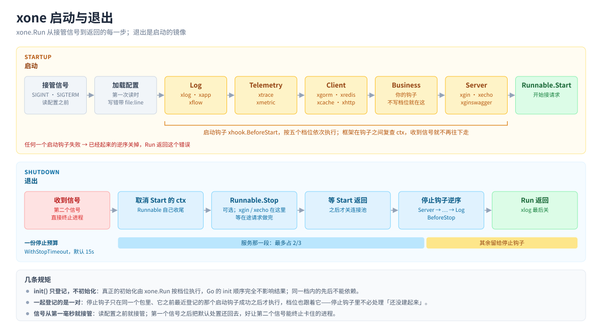

# 架构与设计

这份文档只讲 **为什么是现在这个样子**。怎么用见 [`guide.md`](guide.md)，配置项见 [`config.md`](config.md)，
量过的默认值见 [`behavior.md`](behavior.md)，参与开发见 [`development.md`](development.md)。


*模块分层：核心模块之上，每个带三方依赖的集成是一个独立的 Go module；集成经 `xhook` / `xconfig` 接入框架，不 import 根包。*



*启动与退出：接管信号 → 加载配置 → 按档位执行启动钩子 → `Runnable.Start`；退出时逆序执行停止钩子，整个退出流程共用一份停止预算。*

- [设计原则](#设计原则)
  - [一、`init()` 只登记，不初始化](#一init-只登记不初始化)
  - [二、每个集成是独立的 Go module](#二每个集成是独立的-go-module)
  - [三、每个集成必须导出纯构造器 New](#三每个集成必须导出纯构造器-new)
  - [四、接入框架只有两个动词](#四接入框架只有两个动词)
- [钩子的配对](#钩子的配对)
- [退出信号：从进程起步的第一毫秒就接管](#退出信号从进程起步的第一毫秒就接管)
- [停止预算是一份，不是每个组件一份](#停止预算是一份不是每个组件一份)
- [共用的实现](#共用的实现)
- [模块之间怎么互相扩展](#模块之间怎么互相扩展)
- [配置加载的几个决定](#配置加载的几个决定)

## 设计原则

**给使用者的接口保持最简，复杂性沉到框架里。** 这一条压过下面每一条：能在框架内部消化的，就不推给使用者——
不加新名词、不改他们写的签名、不加一条「你得记住……」的规矩。评估一个改动时先问「使用者要多学什么」，
答案不是「什么都不用」就再想想。已经按这条做了的：配置在 `Start` 之前什么时候读都行（不用知道加载时机）、
Runnable 只要写 `Start`、退出只配一个总时长、`C()` 取不到时说清是调早了还是没配。

### 一、`init()` 只登记，不初始化

Go 的 `init()` 执行顺序是「拓扑序 + 包路径字典序」，使用者控制不了。问题从来不是 `import _` 本身，
而是**很多框架把「登记」和「初始化」合成了一件事**，于是那个不可控的顺序就变成了初始化顺序。

xone 把它们拆开：`init()` 只把「我是谁、怎么初始化我」记进一个列表，真正的初始化由 `Run()` 按档位执行。
**Go 的 init 顺序不影响档位之间的先后**；同一档内按登记顺序，也就是 Go 初始化包的顺序，所以同一档内的东西不能互相依赖。

用固定几档而不是任意数字，是因为数字需要全局协调：谁该填 30、谁该填 50，声明得越多越没人说得清。
业务钩子不写档位，默认落在 `StageBusiness`：全部客户端都已就绪，服务还没起来。

### 二、每个集成是独立的 Go module

Go 的 MVS 会把**整个模块图**里的版本要求强加给使用者——哪怕他一个包都没 import。实测过：一个只 import 了某个零依赖
错误包的应用，自己写死 `gin v1.9.1`，最终被顶到了 `v1.12.0`，还被定死了 gorm、redis、otel 的版本。

所以带三方依赖的集成各自是一个 module。下面是一个只 import 该集成的空应用的模块图大小：

| import | 模块图（不含应用自己） | 其中第三方 |
|---|---|---|
| 核心 `github.com/xiaoshicae/xone`（xapp、xlog、xconfig、xflow、xhook、xerror、xutil、xtls、xonetest） | 3 | 2 |
| `xtrace` | 25 | 23 |
| `xmetric` | 38 | 36 |
| `xcache`（指标经 xmetric） | 42 | 39 |
| `xhttp`（链路经 xtrace） | 58 | 54 |
| `xcron`（链路经 xtrace） | 27 | 24 |
| `xredis`（链路经 xtrace） | 60 | 56 |
| `xgorm`（链路经 xtrace） | 68 | 64 |
| `xgorm/clickhouse` | 131 | 126 |
| `xgin`（链路经 xtrace） | 89 | 85 |
| `xginswagger` | 84 | 82 |
| `xecho`（链路经 xtrace） | 63 | 59 |

量法：在仓库外建一个空的 consumer module，`main.go` 里只写一行 `import _ "<包>"`，`go.mod` 用 `replace`
指向本仓库的各个模块，`GOWORK=off go mod tidy` 之后数 `GOWORK=off go list -m all` 除第一行（应用自己）之外的行数；
「第三方」再去掉 `github.com/xiaoshicae/xone` 开头的。数字随依赖升级会变，改了 `go.mod` 之后重量一次。

- **会产生 Span 的集成（xgin、xecho、xgorm、xredis、xhttp、xcron）依赖 xtrace**：用了它们就有链路，不用另外记得 import xtrace——
  漏了的话不报错，只是 Span 全是 noop、日志没有 `trace_id`。代价实测很小：它们本来就依赖 OpenTelemetry 的 API
  （xgin、xgorm 连 SDK 也有），xtrace 多带进来的只是它自己、b3 传播器和 stdout 导出器，模块图从 85 / 64 / 58 涨到
  上表的 89 / 68 / 60（xgin / xgorm / xredis）。xcache 不产生 Span，不依赖它。
- **你不用的集成，它的依赖不会进你的模块图**，它要求的 Go 版本也不会：核心留在 Go 1.23，集成因为上游需要 Go 1.25。
  每个集成也能独立升大版本。
- 零依赖的（`xlog`、`xflow`、`xapp`）留在核心：分模块是为了把依赖挡在使用者之外，没有依赖可挡就不必多一个模块。
  `scripts/check.sh` 把核心的第三方模块钉在 3 个以内。
- **Swagger UI** 要把整套前端资源编进二进制：只 import gin 是 55 个第三方模块，xginswagger 是 82 个，所以它不是 xgin 的一部分。
- **数据库驱动**：mysql 和 postgres 内置；ClickHouse 驱动多带进 60 多个模块（大头是 clickhouse-go 用来跑集成测试的
  Docker 和 testcontainers，`go.mod` 分不出「只测试用」），所以住在 `xgorm/clickhouse` 里，`xgorm` 只留一个注册点
  （`xgorm.RegisterDialect`）。
- **测试依赖也算数**：`go mod tidy` 会把它记成直接依赖，一样进使用者的模块图。实测给 `xtrace` 加一个只用于测试的
  `otelhttp`，第三方模块从 23 涨到 27。

### 三、每个集成必须导出纯构造器 New

```go
func New(cfg Config) (*T, io.Closer, error)                       // 不碰全局、不读文件、不依赖框架
func New(ctx context.Context, cfg Config) (*T, io.Closer, error)  // 会建连或探测的，多收一个 ctx
```

零装配是默认路径，`New` 保证它**不是唯一路径**：测试直接调它拿一个干净实例，需要两套配置时也有出路。
会阻塞的（`xgorm`、`xredis`、`xtrace`）收 `ctx`，不会阻塞的（`xlog`、`xmetric`、`xcache`、`xhttp`）不收——
签名如实说明这个构造器会不会把你卡住。多实例的模块收的是单个实例的配置（`ClientConfig`）。
`check.sh` 查每个登记了停止钩子的集成都有 `New`。

### 四、接入框架只有两个动词

`xhook.BeforeStart(fn)` / `xhook.BeforeStop(fn)`，钩子里写普通的 Go 代码：`xconfig.Unmarshal(key, &c)` 读配置，
自己建实例、自己存、自己写 `C()`。没有句柄、没有泛型、没有要先理解才能用的名词。写一个集成只需要认识 `xhook` 和
`xconfig` 两个包，而且不许 import 根包：集成不认识框架本体，单独发成 module 也成立。
`check.sh` 给这两个包的公开 API 数量设了上限（各 6 个）：每加一个导出，就是一条所有第三方集成都得跟着理解的规矩。

## 钩子的配对

规则见 [guide「停止钩子：配对与继承」](guide.md#停止钩子配对与继承)，这里记为什么这样定：

- **停止钩子不必处理「还没建起来」。** 启动到一半失败时，后面那些资源根本没建，调它们的停止钩子只会在一堆空值上出错。
- **按「最近的那个」而不是「同包第一个」**：一个包登记好几对时，第二对建不起来，它的停止钩子不该因为第一对成功了就被调到。
- **按包配对，包按调用栈上的 `init` 认，不按钩子函数名**：经一个辅助包替你登记的钩子，函数属于辅助包，按函数认的话
  所有经它登记的包就成了同一个。包取完整的 import path，末段包名会撞（使用者自己包一层叫 xlog 的包很常见）。
- **停止钩子不写档位时继承配对的启动钩子**：停止顺序是启动的整体镜像，一个资源只声明一次档位就同时做到了「先起、后关」。
  显式写了 `At` 的以它为准。
- **没有配对的停止钩子总会执行**，连 Runnable 写错、配置读不出来这种一个启动钩子都没跑的情况也一样：它本来就不依赖启动。

## 退出信号：从进程起步的第一毫秒就接管

注册信号处理这件事本身，**取消了系统原本的「收到就死」**。这是个开关，不是「多加一个处理器」。
所以它装在哪、什么时候还回去，直接决定进程杀不杀得掉。xone 接管 SIGINT 和 SIGTERM，三件事一起做：

1. **信号在读配置之前就接管。** 装在初始化之后的话，连库、连 Redis、重试那几秒里 SIGTERM 走的是系统默认处置——
   进程当场暴毙，已经建好的资源一个都来不及注销（注册中心里那条记录、那把分布式锁，只能等对端超时过期）。
2. **钩子收 `ctx`，框架在每个钩子之前再查一次。** 收到信号后不再跑剩下的启动钩子，已建好的逆序关干净，
   服务不再启动，然后以 `0` 退出——按要求退出不是故障，报成失败的话每次滚动更新撞上这个窗口都会留一条「启动失败」。
3. **第一个信号之后把默认处置还回去。** 框架仍可能卡在某个不看 `ctx` 的第三方调用里，这时**再发一次信号进程立即终止**。
   没有这条逃生口，卡住 = 只有 `kill -9` 收得掉，K8s 得等满整个终止宽限期。

第 3 条同样覆盖关闭阶段：`Stop` 卡住时，第二次 Ctrl+C 有用。

## 停止预算是一份，不是每个组件一份

`xone.WithStopTimeout`（默认 15s）是**整个退出流程**的总预算：从开始退出到 `Run` 返回，最坏也就这么久，
部署环境的终止宽限期留得比它长就够了。它必须真的管住每一步，否则就只是一句话：

- 框架在内部把它分开用：服务（`Stop` + 等 `Start` 返回）最多占前 2/3，其余留给停止钩子，钩子之间再给排在后面的各留一份
  （`min(1s, 剩余时间 ÷ 钩子数)`）——不肯退出的服务、关不掉的连接池都吃不掉别人那份，排在最后的 xlog 总还有时间关文件。
- **xgin / xecho 没有自己的停止超时**：`Stop` 就按服务那一段等在途请求，到点强制断开，再等 handler 真正返回。
  要让它等得更短或更长，调的是总预算——不存在第二个要和它对齐的数。
- `Stop` 和组件的 `Close()` 未必看 `ctx`，所以框架另起协程去等，到点就不再等它。一个连接池关不掉，不该让后面每个组件、
  以及进程本身都排在它后面。
- 必须为正：0 不是「不限时」而是「一点都不等」，`Run` 在做任何事之前就报错。

## 共用的实现

`xgorm` / `xredis` / `xcache` 是同一个形状：配置里可以写一个实例也可以按名字写好几个，运行时 `C()` 按名字取，
启动时挨个建、有一个建不起来就把已建好的全关掉。这些语义本该处处一致——「名字找不到时说什么」「两种写法混用怎么办」
都是一次决定，分散在三个模块里就是三份会各自漂移的实现，所以收成一份：

| 共用的东西 | 在哪 |
|---|---|
| 具名实例、建实例、失败回滚、逆序关闭、取不到时的四种文案 | `internal/xclient.Registry`（不对外） |
| 启动期建连探测：试几次、单次预算、认证 / 证书被拒不再试 | `internal/xclient.Probe`（基于 `xutil.Retry` / `xutil.Permanent`） |
| 单实例 / 多实例两种写法的解码 | `xconfig.UnmarshalClients` |
| 客户端 TLS 块：字段、校验、装出 `*tls.Config` | `xtls.Config`（xgorm、xredis、xhttp 共用；零依赖） |
| 注册指标并断回具体类型 | `xmetric.RegisterAs` |
| Web 服务与框架无关的那一半：监听、h2c、服务端 TLS、优雅关闭；信任的代理；脱敏与敏感词表；访问日志的字段 | `internal/web`（不对外；xgin、xecho 都用它） |

`C()` 取不到实例时直接 panic 并说清是哪一种，因为调早了、调晚了、整块没配、名字写错要查的地方各不相同。
调早了最容易和「整块没配」说成同一句话，让在 `main` 里取实例的人去翻一份写对了的配置文件；
所以整块没配时启动钩子也走一遍 `Build`，注册表由此知道启动钩子跑过了。

- `xclient` 是 internal 的：那是三个模块的共用代码，不是使用者要学的东西。自己写的集成要多实例，一个加锁的 map 就够了。
- 服务端 TLS（xgin、xecho 的 `TLS:` 块，带 `ClientCAFile` / `MinVersion`、没有 `Enable`）形状不同，在 `internal/web` 里，不往 `xtls` 加。
- `internal/web` 同理不对外：使用者看到的仍是 `xgin.Config` 和 `xgin/middleware` 的函数；词表进程里只有一张，
  换一个 Web 框架，client_ip 信谁、日志里遮什么、退出时等不等 handler 都是同一个答案。

## 模块之间怎么互相扩展

下层不认识上层。需要上层能力时，下层持有一个扩展点，上层注入：

| 扩展点 | 注入方 | 作用 |
|---|---|---|
| `internal/logext.SetTraceExtractor` | xtrace | 日志自动带上 `trace_id`，而 xlog 不依赖 OpenTelemetry |
| `internal/logext.AddObserver` | xmetric | 统计错误日志条数，而 xlog 不依赖 Prometheus |
| `xgorm.RegisterDialect` | xgorm/clickhouse 等驱动 module | 加驱动，而 xgorm 不带它的依赖 |
| carrier 的 `TrustedPeer() bool` | xgin、xecho | 告诉 xtrace 这个对端可信，而 xtrace 不认识它们 |

xlog 的两个扩展点放在核心的 `internal/logext` 里（`xlog.SetTraceExtractor` / `xlog.AddObserver` 转发过去），
而不是 xlog 自己：注入方 xtrace、xmetric 于是不 import xlog。xlog 会换掉 `slog.Default()`，
只用 xgorm、xredis 这类集成的程序（它们都带着 xtrace、xmetric）不该因此被接管日志；xlog 只跟着 xgin / xecho / xcron 来。

不用「在 `slog.Default()` 外面包一层」的办法：`slog.SetDefault` 会把标准库 `log` 包的输出也接到新 handler 上，
链条一旦绕回 slog 自带的 handler 就成环，卡死在 `log` 包那把不可重入的锁上。让下层自己持有扩展点就没有这个问题。

## 配置加载的几个决定

规则本身在 [`config.md`](config.md)，这里只记为什么这样定：

- **配置第一次有人读的时候才加载**，而不是在 `Run` 里一次加载完。于是 `main` 里、`Run` 之前读到的也是最终值，
  使用者不必知道加载时机。代价是 `WithConfigPath` 管不到提前的那次读，所以提前读过之后再点名别的文件是错误，而不是悄悄换一份。
- **默认值预填在结构体里，不用 `*bool` 指针。** 文件没写的字段保持不变，`Enable: false` 就是 false。
- **拼错字段、没人读的块都是启动失败。** 两种情况都会让人配了半天才发现不生效，而配置文件是使用者唯一的操作界面。
  「没人读」在全部启动钩子跑完时判：只在 `Start` 里才读的块此时同样没人读过，所以报错里说清该挪到哪里。
- **校验在读的时候做**（`Validate() error`），报错带文件和行号，一个实例都还没连。
- **单实例与多实例不能混用。** 混着写时「default 到底是哪个」没有一个不让人意外的答案。
- **占位符在解析后的节点上展开**，不是对原始字节做文本替换——否则环境变量的值里含冒号或换行就会改变 YAML 结构，
  那是一条注入路径。展开之后标量按新内容重新判定类型，加了引号固定按字符串处理。
- **Import 的相对路径按引它的文件所在目录解析**：配置目录整个搬个位置，里面的相对引用不该跟着失效。
- **profile 与 import 的写法跟 Spring 一致**，合并也一致：map 递归合并、列表整体替换、标量覆盖。列表这条最容易误解——
  逐元素合并的话 `[A,B]` 叠上 `[C]` 会变成 `[C,B]`，你以为换掉了整张表，实际只换掉第一项。
- **一处故意和 Spring 不同**：点名的 profile 文件不存在时直接启动失败。profile 名写错几乎总是笔误，
  静默跳过的结果是一份谁都没看过的配置悄悄以默认值起来。片段的 profile 变体不存在则不算错：拆成十个片段之后
  要求每个都备齐每个环境的变体没法用，而 profile 名写错已经由主文件的变体挡住了。
- **集合里的默认值**：多实例的 `Clients` 由 `UnmarshalClients` 逐个实例铺默认值；别的 map / 切片元素从零值开始解，
  要默认值就给元素类型写 `UnmarshalYAML`，里面用 `xconfig.DecodeStrict`——`node.Decode` 会丢掉严格检查。
